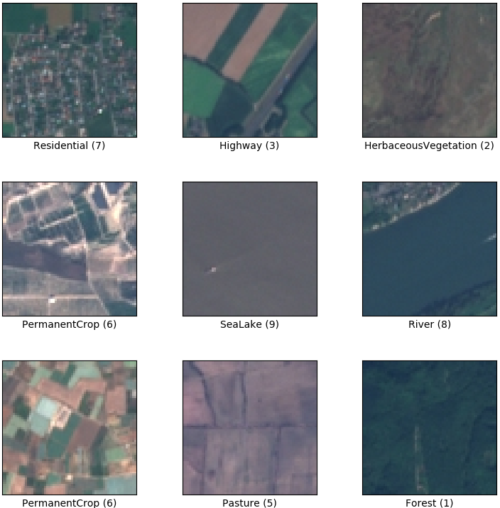

# The Mechanisms Behind Image Classification Using a Pretrained CNN Model in High-Dimensional Spaces

All the material is accessible from 🚀 [Notebook - **EUROSAT classification**](noemie_cohen_EUROSAT.ipynb).

The task at hand is to classify satellite images from the EuroSAT dataset into one of ten classes, namely :

 

    

The EuroSAT dataset is based on Sentinel-2 satellite images covering 13 spectral bands and composed of 10 classes with 27,000 labeled and georeferenced samples.

To accomplish this task, a pre-trained Convolutional Neural Network (CNN) will be used with transfer learning techniques, which involves adapting an existing model to a new task by fine-tuning its parameters. In transfer learning, the pre-trained model acts as a feature extractor, where the early layers of the model learn general features that can be applied to various tasks, while the later layers learn task-specific features. By fine-tuning the pre-trained model's parameters, the model can be adapted to the new task with improved performance compared to training a new model from scratch. 

It is often used in computer vision because it allows for effective training of deep learning models with:
* limited amounts of labeled data
* helps to overcome the problem of overfitting
* avoids using resources to train from scratch
* can improve the accuracy of the model compared to training from scratch

The objective of this project is to **manually** identify the **key features** that are important for classifying satellite images into the ten different classes using transfer learning techniques. By understanding the features that are important for image classification in this domain, we can gain insights into the characteristics of each class and potentially improve the accuracy of the model.

# 📚 Table of contents: 

- 1. [Prepare environement](#dim1)
- 2. [Data Exploration](#dim2)
- 3. [Data Processing](#dim3)
- 4. [Model strategy & transfer](#dim4)
- 5. [Model training & model loading](#dim5)
- 6. [Model evaluation](#dim7)
- 7. [Conclusion](#dim10)

##   1. Prepare environement

This step involves setting up the necessary tools and libraries to work with the EuroSAT dataset.

##   2. Data Exploration

The data exploration section has shed light on issues related to data distribution, as well as provided insights into the upcoming results, particularly regarding similarities between images in three main aspects:

* Colors
* Textures
* Functions

##   3. Data Processing

In this section, we will discuss the normalization process, the creation of train/test datasets, and the development of a transformation pipeline.

**About normalization:**

During the data processing step in computer vision tasks, it is common to normalize the images to improve the performance of the deep learning models. However, finding the appropriate strategy for normalizing the images can be a challenging task.

One of the first questions encountered is how to normalize the images to fit into the pipeline. This involves choosing an appropriate normalization technique that can ensure consistency in the dataset and facilitate the training of the deep learning model.

In this context, the EuroSAT dataset does not have a default normalization method, and therefore, several options are available:

* Option 1: Calculate the mean and standard deviation for each channel (R, G, B) separately and use the transform.Normalize function in PyTorch to apply normalization to the images.

* Option 2: Skip normalization and risk the possibility of the gradients exploding or vanishing during training.

* Option 3: Use the normalization parameters from another dataset, such as the alien/predictors dataset found on Kaggle.

Due to time constraints and the fact that the main objective is not to achieve the best possible results, I have decided to choose Option 3 for normalization of the EuroSAT dataset. It involves using the normalization parameters from another dataset, such as the alien/predictors dataset on Kaggle.

By using the normalization parameters from another dataset, we can save time and avoid the need to calculate the mean and standard deviation for each channel separately. This can be particularly useful in scenarios where time and computational resources are limited.

However, it is important to note that using the normalization parameters from another dataset may not necessarily be optimal for the EuroSAT dataset, as the two datasets may have different characteristics. As a result, it may not produce the best possible results. Nonetheless, since the primary objective of the project is not to achieve the best possible results, using the normalization parameters from another dataset is a reasonable and pragmatic option that can help save time and resources.

##   4. Model strategy & transfer

### Model selection 

When choosing a model, it's important to consider both:
* computational resources and
* model performance. 

In this context, **computational resources** refer to the amount of memory and processing power required to run the model. Models that consume a large amount of resources may not be practical because they require expensive hardware to run that I don't have.

In addition to **model performance**, it's also important to consider model performance. This can be assessed using metrics such as accuracy, precision, recall, and F1 score. In the context of image classification, accuracy is one of the most commonly used metrics. However, accuracy alone may not always be sufficient to evaluate a model's performance, especially when dealing with imbalanced datasets or when the cost of misclassification varies for different classes.

To address this issue, PyTorch provides accuracy metrics for both:
* the top-1 prediction (accuracy 1) and
* the top-5 predictions (accuracy 5). 

The accuracy 1 represents the percentage of images for which the model's top prediction is correct, while accuracy 5 represents the percentage of images for which the correct label is among the model's top 5 predictions.

In the case of EuroSAT dataset, since we are dealing with 10 classes, accuracy 5 is particularly important. After reviewing the accuracy metrics, it appears that ResNet50 has a high level of accuracy and may be a suitable choice for this task. **ResNet50** is a convolutional neural network that has been trained on the ImageNet dataset, which contains over 1.2 million images and 1,000 classes. Its high accuracy on ImageNet and transfer learning capabilities make it a popular choice for various computer vision tasks.

### Hyper parameters selection

For hyperparameter choices in our classification problem, we will use the CrossEntropyLoss criterion. As for optimization techniques, we will consider stochastic gradient descent (optim.SGD) and Adam's Method (optim.Adam). SGD is a simpler approach as the learning rate remains the same for all parameters. On the other hand, Adam is a more advanced optimization algorithm that replaces stochastic gradient descent for training deep learning models. It uses adaptive learning rates for each parameter, which helps to converge faster and often yields better results.

##   5. Model training & model loading

This step is expected to take a long time since deep learning models typically require significant computational resources and time to train. Once the model is trained, it will be saved and loaded for evaluation.

##   6. Model evaluation

This involves assessing the performance of the trained model on the test set and analyzing its probability-based metric and confusion matrix. This will provide insights into the effectiveness of the transfer learning approach for classifying the EuroSAT dataset.

##   7. Conclusions

### Two factors were predominant in this research:

1) **Color**: Some lands are more homogeneous in color when compared to others that have multiple colors. It was found that there are poorly classified images that have color similarities.
> Training the model on black and white data could help remove color biases in the model.

2) **Shapes/Texture**: There are similarities in shape and texture, such as the presence of large rectangles, small rectangles, curves, or bushes, that cause misclassifications.
> One solution could be to rezoom on the images to eliminate the impact of shapes and focus on the textures instead. Another solution could be to research and develop texture-based methods to improve the classification of images.

### Addressing factors contributing to bad predictions:

1) **The rate of unbalanced data** may have had an impact on the accuracies. It was observed that lands with the least number of images had lower accuracies.
> Balancing the dataset by oversampling the minority class, undersampling the majority class, or using a combination of both techniques can help improve the performance of the model.

2) **The crossings between different lands** can cause confusion in classification. For example, a highway that passes through an annual crop can be misclassified.
> One possible solution is to prioritize the rules for detecting certain types of land according to the business needs.    
> Another solution could be to develop a model that is able of detecting multiple types of land in a single image.

3) Classification accuracy crucially depends on the quality of labeling. **Mislabeling** some images can significantly impact the model's performance.
> One solution to this problem could be to manually review the images with low maximum probabilities and relabel them. Additionally, exploring state-of-the-art methods for improving data quality and labeling could also be helpful.

### Interesting next steps

1) **Explanability**   
Further implementation will involve to underline the pixels contributing the most in the input images leading to the model’s outputs. Those methods can be separated in two groups:
**perturbation-based**: Generate perturbed inputs and analyze the evolution of the output of the model for those perturbed inputs. An important feature will greatly change the output when modified. (Those methods are black-box methods.)
**back-propagation**: Use the weights of the model to back-propagate importances from the output to the features. It uses the weights of the model and the neurons activations from a forward pass. Many methods use the gradient of the model, they are consicered back-propagation methods.

> A. Testing on manually modified images such as black and white, to assess the efficacy of classification.   
> B. Using [Xplique library](https://github.com/deel-ai/xplique)

2) Future work will explore the use of other models to improve classification accuracy, while also prioritizing the completion of the initial phase involving comprehensive testing and analysis of the chosen strategy.

# 🎓 Authors

Noémie Cohen
